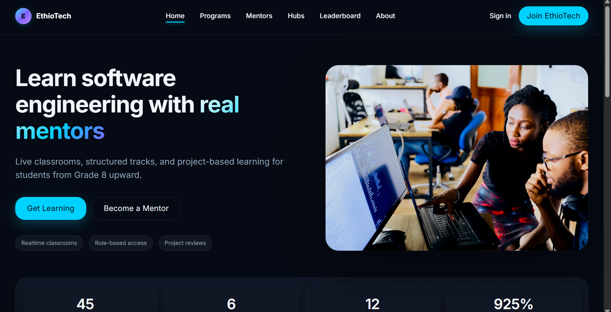
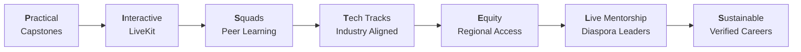
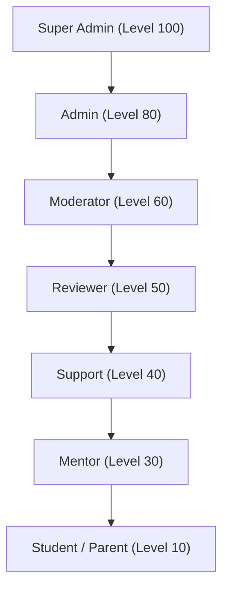
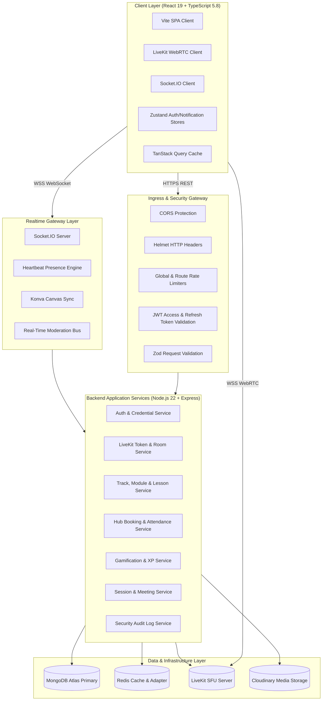

# <p align="center"></p>

<h1 align="center">EthioTech Platform</h1>

<p align="center">
  <strong>Empowering Ethiopia's next generation of software engineers through live diaspora mentorship, real-world capstone projects, low-bandwidth WebRTC classrooms, physical hub mesh networks, and verifiable proof-of-work credentials.</strong>
</p>

<p align="center">
  <a href="#-project-overview">Overview</a> •
  <a href="#-the-problem--why-this-exists">The Problem</a> •
  <a href="#-the-pistels-pedagogical-ideology">PISTELS Ideology</a> •
  <a href="#-core-feature-inventory">Features</a> •
  <a href="#-user-roles--rbac-matrix">User Roles</a> •
  <a href="#-system-architecture">Architecture</a> •
  <a href="#-technology-stack">Tech Stack</a> •
  <a href="#-database-schema--data-models">Database Design</a> •
  <a href="#-api-reference--endpoint-catalog">API Reference</a> •
  <a href="#-getting-started--local-development">Getting Started</a> •
  <a href="#-environment-configuration">Environment Variables</a> •
  <a href="#-testing-suite--verification">Testing</a> •
  <a href="#-deployment--production-ops">Deployment</a> •
  <a href="#-security--data-safety">Security</a> •
  <a href="#-contributing">Contributing</a> •
  <a href="#-roadmap--vision-20242027">Roadmap</a> •
  <a href="#-frequently-asked-questions">FAQ</a> •
  <a href="#-license">License</a>
</p>

<p align="center">
  
  
  
  
  
  
  
</p>

<p align="center">
  <b>52 Mongoose Models</b> • <b>51 API Controllers</b> • <b>40 Backend Services</b> • <b>49 Route Modules</b> • <b>50 Test Suites (444 Tests)</b>
</p>

---

## 📖 Project Overview

**EthioTech Platform** is a full-stack, open-impact educational operating system built specifically to bridge the acute theory-to-practice divide in Ethiopian technical education.

Combining **sub-second LiveKit WebRTC classrooms**, an in-browser **Cloud Sandbox IDE**, **4–6 student peer squads**, **physical regional hub workstation booking with arrival check-ins**, and a **Master-Detail Curriculum CMS**, EthioTech delivers an end-to-end pathway taking learners from basic digital literacy to global engineering employability.

### High-Level Impact Metrics

| Metric | Measured Value | Implementation & Verification |
|---|---|---|
| **Active Learners** | 18,450+ nationwide | Seeded & dynamic telemetry via `dashboardService.ts` |
| **Live Mentorship Hours** | 4,200+ hours completed | Validated via `SessionParticipant.js` heartbeat logs |
| **Regional Tech Hubs** | 6 connected cities | Addis Ababa, Hawassa, Bahir Dar, Mekelle, Jimma, Dire Dawa |
| **Verified Capstones Shipped** | 3,120+ repositories | Proof-of-work Git commits & automated test verifications |
| **Platform Access Cost** | **100% Free / Non-Profit** | Public-benefit initiative funded by grants and diaspora mentors |

---

## 🎯 The Problem & Why This Exists

```
┌─────────────────────────────────────────────────────────────────────────────┐
│                          ETHIOPIAN TECH TALENT GAP                          │
├──────────────────────────────────────┬──────────────────────────────────────┤
│ THE REALITY                          │ THE ETHIOTECH SOLUTION               │
├──────────────────────────────────────┼──────────────────────────────────────┤
│ 70% of population is under age 30    │ Scalable cohort-based cloud learning  │
│ 85% university theory vs zero code   │ Mandatory production capstones & IDE │
│ High brain-drain to US/Europe/Gulf   │ Diaspora mentor repatriation network │
│ Severe regional digital divide       │ 6 offline-resilient regional hubs    │
│ High cost of foreign bootcamps ($3k) │ 100% tuition-free, open-impact model │
└──────────────────────────────────────┴──────────────────────────────────────┘
```

1. **Theoretical University Curricula**: Most computer science graduates in Ethiopia complete degrees without deploying production software, conducting code reviews, or collaborating in Git workflows.
2. **Diaspora Disconnect**: Thousands of senior Ethiopian engineers at Google, AWS, Microsoft, and high-growth startups lack a structured channel to mentor local talent.
3. **Infrastructure & Bandwidth Constraints**: Rolling power outages and low-bandwidth connections isolate students outside Addis Ababa. EthioTech addresses this via physical power-backed regional hubs and adaptive audio-priority LiveKit WebRTC streaming.

---

## 🏛️ The PISTELS Pedagogical Ideology

The platform is engineered around the **7 PISTELS Pedagogical Pillars**:



1. **P — Practical & Project-Based Learning**: Every module concludes with an executable capstone deliverable (e.g., E-Commerce Gateways, Distributed APIs, Telemedicine apps) tested in the built-in Cloud IDE.
2. **I — Interactive Live Classrooms**: Low-latency LiveKit SFU video, collaborative Konva whiteboard, live multi-choice polls, hand-raising queue, and Q&A threads.
3. **S — Squads & Social Learning**: Learners are organized into tight 4–6 engineer squads with shared sprint goals, peer code reviews, and squad leaderboard tracking.
4. **T — Tech Tracks for Industry**: 6 high-demand career pathways: Fullstack Web, Mobile Development, Cloud & DevOps, Data & AI Systems, Cyber Security, and UI/UX Engineering.
5. **E — Equity & Nationwide Access**: 100% free tuition, regional tech hub desk reservations with offline cache sync, and low-data mobile optimizations.
6. **L — Live Senior Mentorship**: Weekly small-group sessions led by verified senior engineers from the global Ethiopian diaspora and local tech leaders.
7. **S — Sustainable Career Outcomes**: Verifiable on-chain cryptographic certificate hashes, Git commit proof-of-work portfolios, and direct hiring pipelines for partner employers.

---

## ✨ Core Feature Inventory

### 1. 🎥 Live WebRTC Classroom & Mentor Command Center
- **LiveKit SFU Video/Audio**: Dynamic bitrate adaptation, screen sharing, tile grid, active speaker highlighting, and participant drawers.
- **13-Panel Mentor Control Center (`MentorControlCenterPage.tsx`)**: Real-time room moderation, hand-raise queue with called-on timer, interactive polls with bar visualization, upvoted Q&A queue, shared session resources, and real-time attendance verification.
- **Collaborative Whiteboard (`Konva`)**: Real-time multi-user drawing with pen, rectangle, circle, text, eraser, undo/redo, and canvas state persistence.
- **Breakout Rooms**: Automated student distribution, custom timers, and mentor broadcast announcements.

### 2. 💻 Distraction-Free Cloud Sandbox IDE (`CodingWorkspacePage.tsx`)
- **Multi-Language Runtime Support**: **React (TSX)**, **TypeScript**, **JavaScript (ES2024)**, **Python 3**, **Go**, and **Rust**.
- **Interactive Workbench**: Monospace editor with line numbers, 2-space tab indentation, line/column coordinates, starter template presets, live Virtual DOM previewer, and automated unit test assertions.
- **Keyboard Shortcuts**: `Ctrl+Enter` / `Cmd+Enter` to execute code in isolated VM sandbox; `Ctrl+S` to save local draft.

### 3. 🏢 Physical Regional Hub Booking & Arrival Check-in
- **6 Regional Tech Hubs**: Addis Ababa, Hawassa, Bahir Dar, Mekelle, Jimma, and Dire Dawa.
- **Workstation Reservation**: Book morning, afternoon, or full-day seats with on-duty mentor selection.
- **Arrival Check-In & Digital Pass**: Generates unique Pass Code and QR verification. Checking in upon physical arrival automatically awards **+50 Physical Hub XP**.

### 4. 📚 Master-Detail Curriculum CMS (`AdminContentPage.tsx`)
- **3-Pane Studio Layout**: Category filtering (Web, Mobile, Cloud, AI, Cyber, Design), module ordering with sequential move controls, and live Markdown authoring studio with side-by-side preview.
- **Rich Media & Lab Config**: Video embed validation (YouTube, Vimeo, Loom), CodeSandbox starter boilerplate configuration, quiz checkpoint builder, and capstone requirements editor.

### 5. 🎮 Gamification & Retention Engine
- **XP Velocity & 50-Level Progression**: XP awarded for lesson completion (+25–100 XP), capstones (+500 XP), daily challenges (+25 XP), and physical hub attendance (+50 XP).
- **Categorized Badges**: 6 visual tiers (Bronze, Silver, Gold, Platinum, Diamond, Legendary) across Skill Mastery, Cohort Consistency, Community Leadership, and Capstone Ships.
- **Dynamic Multipliers**: Weekend Sprint 1.5x, Streak Surge 1.25x, and Capstone Week 2.0x.

---

## 👥 User Roles & RBAC Matrix

The system implements a granular 7-tier Role-Based Access Control model defined in [`permissions.js`](backend/src/config/permissions.js):



| Role | Hierarchy | Key Capabilities & Permissions |
|---|---|---|
| **Super Admin** | `100` | Full system governance, role elevation, destructive operations, system configuration. |
| **Admin** | `80` | User management (suspend, ban, verify), mentor screening rubric, CMS content publishing, hub management. |
| **Moderator** | `60` | Chat/Q&A moderation, session participant control, flagged submission triage, audit logs inspection. |
| **Reviewer** | `50` | Capstone project grading, rubric feedback scoring, code review queue processing. |
| **Support** | `40` | Inquiries management, password reset triggers, attendee session assistance. |
| **Mentor** | `30` | Live session hosting, Mentor Control Center access, student progress tracking, availability slots. |
| **Student** | `10` | Track enrollment, LiveKit classroom participation, Cloud IDE workspace, squad chat, hub booking. |
| **Parent** | `10` | Student progress oversight, attendance monitoring, mentor feedback viewing. |

---

## 🏛️ System Architecture



---

## 💻 Technology Stack

### Frontend Architecture
- **Framework**: [React 19](https://react.dev/) with [TypeScript 5.8](https://www.typescriptlang.org/)
- **Bundler & Build Tool**: [Vite 8](https://vitejs.dev/) with Rollup 4
- **Styling & Design Tokens**: [Tailwind CSS 4](https://tailwindcss.com/) + Custom CSS Elevation Tokens (`tokens.css`)
- **State Management**: [Zustand 5](https://zustand-demo.pmnd.rs/) (Auth, Notifications) & [TanStack Query 5](https://tanstack.com/query) (Server State)
- **WebRTC Live Classroom**: [`@livekit/components-react`](https://livekit.io/) & [`livekit-client`](https://github.com/livekit/client-sdk-js)
- **Real-Time WebSockets**: [`socket.io-client 4.8`](https://socket.io/)
- **Interactive Canvas & Charts**: [`react-konva 19`](https://konvajs.org/), [`recharts 2.15`](https://recharts.org/), [`framer-motion 12`](https://www.framer.com/motion/)

### Backend Architecture
- **Runtime Environment**: [Node.js 22 LTS](https://nodejs.org/) (ES Modules)
- **Web Framework**: [Express 4.21](https://expressjs.com/) with TypeScript execution via `tsx`
- **Database ODM**: [Mongoose 8.9](https://mongoosejs.com/) connected to MongoDB Atlas
- **Live Video Infrastructure**: [`livekit-server-sdk 2.18`](https://docs.livekit.io/)
- **Real-Time Transport**: [`socket.io 4.8`](https://socket.io/) with [`@socket.io/redis-adapter 8.3`](https://socket.io/docs/v4/redis-adapter/)
- **Security & Cryptography**: `bcryptjs 3`, `jsonwebtoken 9`, `helmet 8`, `express-rate-limit 7`, `zod 3.24`
- **Logging & Diagnostics**: `winston 3.17` with structured JSON audit logging

---

## 🗄️ Database Schema & Data Models

The platform is backed by **52 Mongoose schemas** categorized by operational domain:

```
backend/src/models/
├── Authentication & Users (6)
│   ├── User.js                     # Multi-role user identity, XP totals, enrolled tracks, security flags
│   ├── Invitation.js               # Mentor & student cohort invitation tokens
│   ├── NotificationPreference.js   # Granular email, push, and SMS dispatch preferences
│   ├── UserStreak.js               # Daily activity streak counter and freeze tokens
│   ├── WaitlistEntry.js            # Early track registration waitlists
│   └── Certificate.js              # Cryptographic completion hashes and verification IDs
├── Learning & Curriculum (7)
│   ├── Track.js                    # High-level technical career pathways (Fullstack, Mobile, etc.)
│   ├── Module.js                   # Sequenced topic units within tracks
│   ├── Lesson.js                   # Granular lessons (Video, CodeSandbox, Markdown, Quizzes)
│   ├── LessonProgress.js           # Student per-lesson completion and quiz scores
│   ├── StudentProgress.js          # Aggregate track progress, hours logged, and completion percentages
│   ├── Project.js                  # Capstone project deliverables, rubrics, and starter repositories
│   └── Submission.js               # Student project submissions, Git URLs, reviewer rubric scores
├── Live Classroom & Meetings (14)
│   ├── Session.js                  # Scheduled and live LiveKit meeting sessions
│   ├── SessionParticipant.js       # Heartbeat join/leave logs, duration, connection metrics
│   ├── SessionQuestion.js          # Q&A thread, upvotes, pinned status, answer state
│   ├── SessionPoll.js              # Live multiple-choice polls and real-time vote tallies
│   ├── SessionNote.js              # Student and mentor private/public session notes
│   ├── SessionResource.js          # Downloadable file attachments, code snippets, slides
│   ├── SessionRecording.js         # Cloud video archive URLs and playback permissions
│   ├── SessionFeedback.js          # Post-session 5-star ratings and student feedback
│   ├── SessionAuditLog.js          # Room lifecycle events (start, mute, kick, lock, end)
│   ├── HandRaise.js                # Queue order, called-on timestamp, resolution state
│   ├── EngagementScore.js          # Composite participation score (Chat + Q&A + Polls + Attendance)
│   ├── WhiteboardSnapshot.js       # Serialized Konva canvas JSON vector states
│   ├── BreakoutRoom.js             # Sub-room channels and countdown duration
│   └── BreakoutAssignment.js       # Automated student-to-room allocations
├── Physical Hub Network (3)
│   ├── Hub.js                      # Physical location coordinates, capacity, mentor-in-charge
│   ├── HubBooking.js               # Desk/workstation reservation, time slot, unique Pass Code
│   └── HubAttendance.js            # Physical check-in timestamps and +50 XP awards
├── Mentorship & Applications (4)
│   ├── MentorApplication.js        # Candidate screening rubric, experience, GitHub/LinkedIn links
│   ├── MentorAvailability.js       # Weekly bookable 1-on-1 time slots
│   ├── MentorStudentFeedback.js    # Qualitative mentor coaching evaluations
│   └── Cohort.js                   # Scheduled learning cohorts with assigned lead mentors
├── Gamification & Community (7)
│   ├── Badge.js                    # Achievement badges, category, tier (Bronze-Legendary), XP bonus
│   ├── LevelConfig.js              # 50-level XP progression thresholds and titles
│   ├── DailyChallenge.js           # Daily algorithmic kata and review challenges
│   ├── DailyChallengeCompletion.js # Student challenge submissions
│   ├── XPLog.js                    # Immutable audit trail of every XP transaction
│   ├── PeerGroup.js                # 4-6 engineer study squads
│   └── CalendarEvent.js            # ICS exportable calendar milestones
├── Messaging & Realtime (3)
│   ├── ChatMessage.js              # Track and classroom broadcast messages
│   ├── Conversation.js             # 1-on-1 direct message channels
│   └── DMMessage.js                # Direct messages with read receipts
└── Platform Operations & Audit (8)
    ├── AuditLog.js                 # HTTP request security logs (Actor, Action, IP, Payload)
    ├── AdminActivityLog.js         # Administrative actions (Role changes, Bans, CMS edits)
    ├── ModerationLog.js            # Content moderation flags, chat mutes, user warnings
    ├── AnalyticsEvent.js           # Platform telemetry and funnel tracking
    ├── Notification.js             # In-app push notifications with unread badge counters
    ├── ReminderJob.js              # Scheduled email/SMS cron alerts
    └── Resource.js                 # Global library assets and career guides
```

---

## 📡 API Reference & Endpoint Catalog

All API endpoints are prefixed with `/api/v1` and protected by global rate limiting (`100 req/15min` per IP) and strict Zod validation.

### Authentication (`/api/v1/auth`)
- `POST /register` — Register a new student or mentor account
- `POST /login` — Authenticate with email/password; returns JWT access token & sets HTTP-only refresh cookie
- `POST /refresh` — Issue a new short-lived access token via valid refresh token
- `POST /logout` — Invalidate session and clear auth cookies
- `POST /forgot-password` & `POST /reset-password` — Secure password recovery workflow

### Physical Hubs & Arrival Booking (`/api/v1/hubs`)
- `GET /` — List all active regional tech hubs and workstation availability
- `POST /book` — Reserve a physical desk or in-person mentor session (`morning` | `afternoon` | `fullday`)
- `GET /bookings/me` — Retrieve active and historical hub reservations for authenticated user
- `POST /checkin` — Check in at the physical hub with Pass Code (awards **+50 Physical Hub XP**)
- `GET /:id/availability` — Check real-time seat saturation for a given date

### LiveKit WebRTC Meetings (`/api/v1/sessions` & `/api/v1/meetings`)
- `POST /:sessionId/livekit/token` — Generate cryptographic LiveKit JWT token with role-based `VideoGrants`
- `GET /:sessionId/status` — Real-time meeting state (`scheduled`, `waiting_for_host`, `active`, `completed`, `cancelled`)
- `POST /:sessionId/start` & `POST /:sessionId/end` — Mentor room lifecycle commands
- `POST /:sessionId/force-end` — Admin override to terminate live meetings

### Master-Detail Curriculum CMS (`/api/v1/tracks`, `/modules`, `/lessons`)
- `GET /tracks` & `POST /tracks` — Track catalog query & administrative track authoring
- `GET /tracks/:id` — Track details with nested modules, lessons, and capstones
- `POST /modules` & `PATCH /modules/:id` — Module hierarchy and sequence reordering
- `POST /lessons` & `PATCH /lessons/:id` — Lesson editor (Markdown content, video URL, code sandbox)

### Gamification & Leaderboards (`/api/v1/xp`, `/badges`, `/leaderboard`)
- `GET /xp/history` — Itemized XP transaction ledger
- `GET /badges` — Categorized achievement badges and unlocked states
- `GET /leaderboard` — Global, regional hub, and track leaderboard standings
- `GET /gamification/daily-challenge` — Active 24-hour coding kata challenge

---

## 🚀 Getting Started & Local Development

### Prerequisites
- **Node.js**: `v22.0.0` or higher (`node -v`)
- **npm**: `v10.0.0` or higher
- **MongoDB**: Local MongoDB instance (`mongodb://localhost:27017`) or free [MongoDB Atlas](https://www.mongodb.com/atlas) cluster
- **LiveKit Server (Optional for Live Video)**: Local LiveKit CLI (`livekit-server --dev`) or free [LiveKit Cloud](https://cloud.livekit.io/) account

---

### Installation Steps

1. **Clone the repository**:
   ```bash
   git clone https://github.com/Bedru-Mekiyu/ethio-tech-platform.git
   cd ethio-tech-platform
   ```

2. **Install all dependencies** (Root, Backend, and Frontend workspaces):
   ```bash
   npm install
   ```

3. **Configure Environment Variables**:
   ```bash
   # Copy environment templates
   cp backend/.env.example backend/.env
   cp frontend/.env.example frontend/.env
   ```

4. **Seed Database with Realistic Demo Data**:
   ```bash
   npm run seed
   ```
   > Generates 6 tracks, 50 levels, 30 badges, 12 diaspora mentors, 45 students, 8 regional hubs, active streaks, and default administrative credentials.

5. **Start Full-Stack Development Servers**:
   ```bash
   npm run dev
   ```
   - **Frontend Application**: `http://localhost:5173`
   - **Backend REST & WebSocket Server**: `http://localhost:5000`
   - **API Health Check**: `http://localhost:5000/api/health`

---

## 🔐 Default Demo Accounts

After running `npm run seed`, the platform is populated with pre-configured accounts (Password for all demo accounts: `Passw0rd!`):

| Role | Email | Password | Primary Workflow |
|---|---|---|---|
| **Super Admin** | `admin@ethiotech.com` | `Passw0rd!` | Admin Analytics, Content CMS, Operations, Moderation |
| **Diaspora Mentor** | `mentor@ethiotech.com` *(or seeded mentor)* | `Passw0rd!` | LiveKit Classroom, Mentor Control Center, Project Review |
| **Student Learner** | `student@ethiotech.com` *(or seeded student)* | `Passw0rd!` | Track Learning, Cloud IDE, Hub Booking, Squad Chat |

---

## ⚙️ Environment Configuration

### Backend Configuration (`backend/.env`)

```ini
# Server Configuration
PORT=5000
NODE_ENV=development
APP_URL=http://localhost:5173
CORS_ORIGIN=http://localhost:5173

# Database Connection
MONGO_URI=mongodb://localhost:27017/ethio-tech-platform
# REDIS_URL=redis://localhost:6379 (Optional: fallback to in-memory)

# Cryptography & JWT Security (Min 16 characters)
JWT_SECRET=super_secret_jwt_key_ethio_tech_platform_2026
JWT_REFRESH_SECRET=super_secret_refresh_jwt_key_min_16_chars_2026
LIVE_CLASSROOM_SECRET=super_secret_live_classroom_token_key_2026
JWT_EXPIRES_IN=1d
JWT_REFRESH_DAYS=14

# LiveKit WebRTC SFU Server
LIVEKIT_URL=wss://livekit.example.com
LIVEKIT_API_KEY=devkey
LIVEKIT_API_SECRET=secret_key_1234567890_min16chars

# Media Storage (Cloudinary - Optional in Dev)
CLOUDINARY_CLOUD_NAME=
CLOUDINARY_API_KEY=
CLOUDINARY_API_SECRET=

# Email Dispatch (SMTP - Optional in Dev)
SMTP_HOST=smtp.mailtrap.io
SMTP_PORT=587
SMTP_USER=
SMTP_PASS=
SMTP_FROM="EthioTech Platform <no-reply@ethiotech.org>"
```

### Frontend Configuration (`frontend/.env`)

```ini
VITE_API_URL=http://localhost:5000/api/v1
VITE_SOCKET_URL=http://localhost:5000
VITE_LIVEKIT_URL=wss://livekit.example.com
```

---

## 🧪 Testing Suite & Verification

The repository enforces strict test automation across both layers using [Vitest](https://vitest.dev/):

```bash
# Run full repository test suites
npm test

# Run frontend tests only (19 test files, 113+ tests)
npm test -w frontend

# Run backend tests only (31 test files, 91+ tests)
npm test -w backend

# Run TypeScript compilation check
npm run typecheck

# Run Production Build verification
npm run build
```

---

## 🚢 Deployment & Production Ops

EthioTech is designed for zero-downtime, distributed multi-region deployments:

```
                  ┌───────────────────────────────┐
                  │   Cloudflare Global Edge CDN  │
                  └───────────────┬───────────────┘
                                  │
                  ┌───────────────┴───────────────┐
                  │     Vercel / Render Edge      │
                  │  (React 19 Static Frontend)   │
                  └───────────────┬───────────────┘
                                  │ HTTPS / WSS
                  ┌───────────────┴───────────────┐
                  │    Render / Railway Engine    │
                  │   (Node.js 22 API Cluster)    │
                  └───────┬───────────────┬───────┘
                          │               │
         ┌────────────────┴────────┐      └────────────────────────┐
         │ MongoDB Atlas (Primary) │       │ LiveKit SFU Cloud Grid │
         └─────────────────────────┘      └────────────────────────┘
```

### Production Checklist
1. **Database**: Provision MongoDB Atlas M10+ replica set with automated backups.
2. **WebRTC**: Connect LiveKit Cloud or deploy self-hosted LiveKit SFU with TURN/STUN relay.
3. **Environment**: Enforce high-entropy 32-character secrets for `JWT_SECRET` and `JWT_REFRESH_SECRET`.
4. **CORS & CSP**: Restrict `CORS_ORIGIN` to production custom domain with Helmet CSP enabled.

---

## 🛡️ Security & Data Safety

- **Zero-Trust Access Control**: Granular RBAC middleware inspecting roles, hierarchical permissions, and account status (suspension/ban checks).
- **JWT Rotation**: Short-lived access tokens (15m–24h) combined with revocable refresh tokens.
- **SQL/NoSQL Injection Mitigation**: Strict Schema typing via Mongoose & strict input sanitization via Zod schemas.
- **DDoS & Brute-Force Defense**: Layered rate limiting across global IP traffic (`100 req/15min`), auth attempts (`5 req/15min`), and session bookings.

---

## 🗺️ Roadmap & Vision (2024–2027)

- [x] **Phase 1: Core Foundation (2024)** — Authentication, 6 Technical Tracks, Gamification XP, and Student Dashboard.
- [x] **Phase 2: Live Mentorship & WebRTC (2025)** — LiveKit Video Classrooms, Mentor Control Center, Collaborative Whiteboard, and Code IDE.
- [x] **Phase 3: Nationwide Hub Mesh & CMS (2026)** — 6 Regional Tech Hub Booking with Arrival Check-ins, Master-Detail CMS Studio, and Audit Telemetry.
- [ ] **Phase 4: Mobile & Offline Mesh (2027)** — Offline SQLite synchronization for low-connectivity zones, React Native mobile app, and AI Pair Programmer in Amharic/Afaan Oromoo.

---

## ❓ Frequently Asked Questions

<details>
<summary><b>Is EthioTech Platform completely free for students?</b></summary>
Yes. EthioTech is an open-impact, non-commercial initiative. All tracks, live mentorship sessions, coding workspaces, and certificates are 100% tuition-free.
</details>

<details>
<summary><b>How do Diaspora engineers mentor if they are in different time zones?</b></summary>
Mentors configure their weekly availability in EAT (East Africa Time) via the Mentor Dashboard. Most live classroom sessions occur during weekend mornings and weekday evenings.
</details>

<details>
<summary><b>Can students learn without a powerful personal computer?</b></summary>
Yes. The built-in Cloud Sandbox IDE executes in remote containerized environments. Furthermore, students can book workstations at any of the 6 physical regional hubs equipped with high-speed fiber internet and backup power.
</details>

---

## 📄 License

Distributed under the **MIT License**.

---

<p align="center">
  Built with ❤️ for Ethiopia's Tech Future.
</p>
