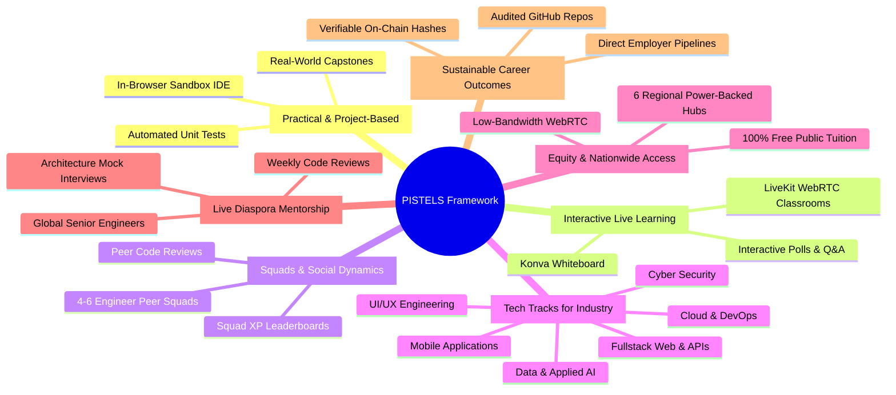

# The PISTELS Pedagogical Framework

**PISTELS** is the foundational learning methodology powering the EthioTech Platform. Engineered specifically to solve the acute shortage of practical engineering competency in Sub-Saharan Africa, PISTELS combines cognitive apprenticeship with hands-on software development.

---

## The 7 Pillars Explained

### 1. P — Practical & Project-Based Learning
Students do not merely watch videos; they build executable systems from Day 1. Every curriculum track concludes with mandatory, production-grade capstones (e.g., High-Concurrency Payment Gateways, Offline Telemedicine APIs, Distributed Caching Systems) validated through automated test assertions in the built-in Cloud IDE.

### 2. I — Interactive Live Learning
Lectures are replaced with high-interaction LiveKit WebRTC sessions. Mentors use interactive code annotations, real-time multi-choice concept checks, whiteboard system design diagrams, and live question upvoting queues to maintain deep cognitive engagement.

### 3. S — Squads & Social Learning
Isolation is the primary driver of online bootcamp dropouts. EthioTech groups every student into a 4–6 person peer squad. Squad members participate in daily standups, review each other's pull requests, and compete on the cohort leaderboard.

### 4. T — Tech Tracks for Industry
Curricula are aligned with high-growth international and regional engineering hiring demands across 6 specialized tracks:
- **Fullstack Web Engineering**: React 19, TypeScript, Node.js, PostgreSQL, Redis.
- **Mobile Application Development**: Flutter, React Native, Mobile Payment integrations (Telebirr/Chapa).
- **Cloud & DevOps**: Docker, Kubernetes, Terraform, AWS, CI/CD pipelines.
- **Data & Applied AI**: Python, PyTorch, LLM fine-tuning, Amharic/Afaan Oromoo NLP.
- **Cyber Security**: Penetration testing, SOC defense, zero-trust architectures, OWASP top 10.
- **UI/UX Engineering**: Design systems, accessibility (a11y), Figma-to-code workflows.

### 5. E — Equity & Nationwide Access
To ensure regional inclusivity, the platform operates 6 physical tech hubs (Addis Ababa, Hawassa, Bahir Dar, Mekelle, Jimma, Dire Dawa) equipped with enterprise gigabit fiber, solar/generator backup power, and workstations.

### 6. L — Live Diaspora Mentorship
Ethiopia's global diaspora includes staff and principal engineers at top tech institutions. EthioTech provides a frictionless platform for diaspora leaders to conduct weekly small-group mentorship, code reviews, and mock technical interviews.

### 7. S — Sustainable Career Outcomes
Graduation requires cryptographic verification of Git commits, passing rubric-based code reviews by senior mentors, and shipping public showcase repositories. Verified graduates enter direct hiring pipelines with vetted employer partners.
